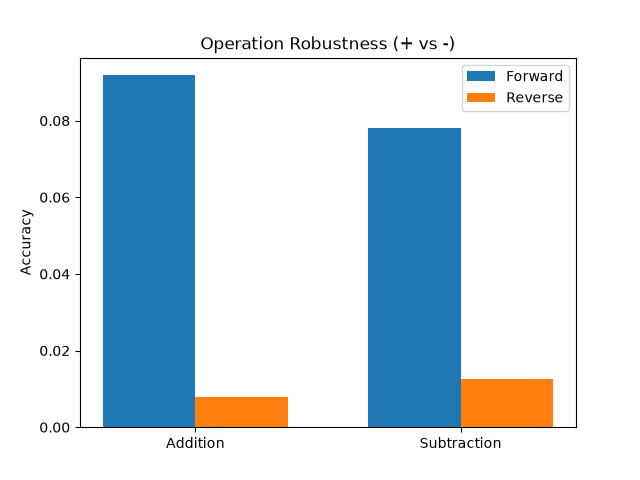
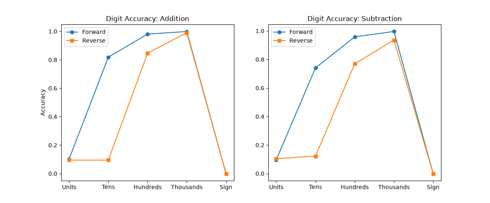

# Extending the Addition LLM: A Comparative Analysis of Prediction Paradigms

When we set out to expand our baseline addition-only model to handle both addition and subtraction, the most immediate change was expanding the tokenizer's vocabulary to recognize the minus (`-`) symbol. However, simply adding a new token doesn't address the core complexity of algorithmic tasks. Subtraction introduces negative numbers and complex borrow mechanics that strain standard left-to-right text generation. 

To explore how the direction of text generation impacts mathematical reasoning, we developed two distinct models: a **Forward Mode** model (which predicts results natively from left-to-right, e.g., `-15`) and a **Reverse Mode** model. For the Reverse paradigm, we inverted the target sequences during data generation (e.g., `-15` becomes `51-`). Because the causal Transformer predicts tokens autoregressively, this inversion forces the model to compute and predict the units digit *before* the tens digit, natively mirroring the right-to-left flow of human arithmetic.

### Operation Robustness: Addition vs. Subtraction

Evaluating the models on a held-out test set of 10,000 balanced samples revealed a consistent trend: subtraction is fundamentally harder for the LLM to master than addition. 

This disparity occurs because subtraction introduces a conditional complexity that addition lacks. The model doesn't just have to manage borrows (which are mathematically analogous to carries); it must also evaluate the global relationship between the two operands (i.e., is A > B?) to determine if a negative sign is required. 

### Digit-Level Performance and The Directional Effect

The true power of prediction direction becomes obvious when we break down accuracy position by position. 

In **Forward Mode**, the model is forced to predict the highest-order digit (or the negative sign) *first*. This is a massive mathematical handicap. To correctly guess the hundreds digit of a sum, the model must simultaneously compute the units and tens columns entirely in its hidden states to check for cascading carries, without any visible "scratchpad" to rely on. If it miscalculates a carry early in the generation, the entire sequence breaks down, leading to the sharp drop-off in accuracy we see for right-most digits in the Forward plots.

**Reverse Mode** elegantly sidesteps this issue. By forcing the model to output the units digit first, it effectively creates its own context. When predicting the tens digit, the model's attention heads can directly reference the just-generated units digit to help resolve any carry or borrow operations. This localizes the mathematical dependencies. While Reverse mode can feel counter-intuitive to string processing, it provides a significantly more robust foundation for algorithmic learning because it resolves local arithmetic dependencies before attempting to resolve global outputs like the final sign.

### Synthesis and Recommendations

The core strength of the Reverse mode is its alignment with intrinsic mathematical properties, yielding much more stable digit-by-digit accuracy. However, its primary limitation is practicality: it requires strict data pre-processing and generates strings that are entirely unreadable to humans without post-processing. Furthermore, as equations scale to larger numbers, the sheer distance between the operands in the prompt and the final sign token in the reversed output could begin to strain the model's context window and positional embeddings.

To bridge this gap in future iterations, I highly recommend exploring "Chain of Thought" or "Scratchpad" paradigms over strict Reverse mode. By allowing the model to explicitly write out its intermediate carry/borrow logic left-to-right *before* generating the final answer, we can achieve the mathematical soundness of right-to-left calculation while maintaining the natural, human-readable flow of standard language models.
